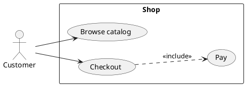
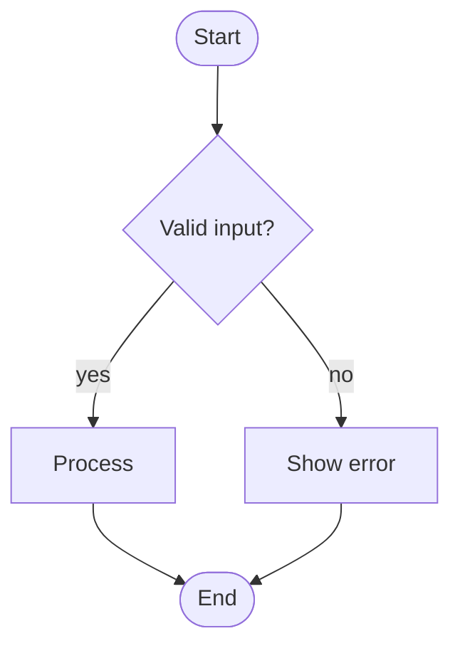
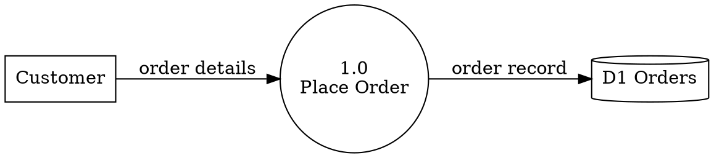

# Diagrammer

Turn a description into a correct, renderable diagram. Choose the tool by type, write the
source to a file, render it, report both paths.

## Tool selection

| Diagram type                       | Tool                  | File ext      | Why |
|------------------------------------|-----------------------|---------------|-----|
| Use Case                           | PlantUML              | `.puml`       | Native actors/use cases, include/extend |
| Control Flow / flowchart           | Mermaid               | `.mmd`        | Renders natively in GitHub & artifacts |
| Activity w/ swimlanes              | PlantUML              | `.puml`       | When you need partitions / parallel forks |
| Data Flow Diagram (DFD)            | Graphviz *or* PlantUML| `.dot`/`.puml`| Correct DFD shapes; multi-level layout |
| Sequence / Class / State / ER      | Mermaid               | `.mmd`        | Native, portable |

Default: Mermaid for control flow, PlantUML for use case, Graphviz for multi-level DFD.
If the user names a tool, obey it.

## Workflow

1. **Clarify the subject** if vague. For a DFD confirm the level (Context/0 vs Level-1).
   For a use case confirm the actors and the system boundary. Ask at most one focused
   question; otherwise proceed with reasonable assumptions and state them.
2. **Pick the tool** from the table.
3. **Write the source** to a file in the user's working dir (`<name>.mmd` / `.puml` /
   `.dot`) AND show it in a fenced block (` ```mermaid ` / ` ```plantuml ` / ` ```dot `).
4. **Render** if a renderer is available:
   - Windows: `pwsh ${CLAUDE_PLUGIN_ROOT}/scripts/render.ps1 -File <file> -Format svg`
   - macOS/Linux: `${CLAUDE_PLUGIN_ROOT}/scripts/render.sh <file> svg`
   Report the output path. If the renderer is missing, print its install line and stop —
   **do not** silently send source to an external server (the script gates that behind
   `-AllowRemote` / `--allow-remote`).
5. **Report**: source file path + rendered image path, or the exact install step needed.

## Quick templates

Use Case (PlantUML) — full syntax in `references/usecase.md`:


Control Flow (Mermaid) — full syntax in `references/controlflow.md`:


DFD (Graphviz) — notation + levels in `references/dfd.md`:


## Conventions

- **DFD**: external entity = rectangle, process = circle (Yourdon) / rounded box
  (Gane–Sarson) and is **numbered** (1.0, 2.0), data store = open-ended box / cylinder,
  data flow = **labeled** arrow. A Context diagram has exactly **one** process (0). Stores
  and entities never connect directly — data passes through a process. It is not a
  flowchart: no decisions/control, only data movement.
- **Use case**: verbs for use cases ("Place order"), nouns for actors. `<<include>>` for
  always-run sub-flows, `<<extend>>` for conditional ones, `<|--` for generalization.
- **Control flow**: stadium nodes `([...])` for start/end, diamonds `{...}` for decisions,
  label every branch (yes/no). One entry, clear exits.
- **File naming**: kebab-case with optional type suffix (`login-usecase.puml`,
  `checkout-flow.mmd`, `order-dfd.dot`).

## Rendering deps (install only what you use)

- Mermaid: `npm install -g @mermaid-js/mermaid-cli` (provides `mmdc`).
- Graphviz: `choco install graphviz` (Win) / `brew install graphviz` / `apt install graphviz` (provides `dot`).
- PlantUML: the `plantuml` CLI, or Java + `plantuml.jar` with `$env:PLANTUML_JAR` set.
- No local renderer? `render.*` can fall back to **kroki.io** with `-AllowRemote` /
  `--allow-remote` (sends source over the network — off by default).

Deep syntax per type lives in `references/`.
