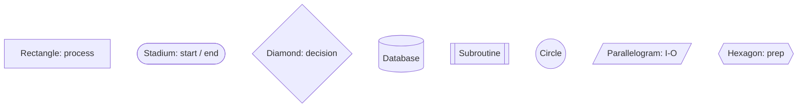
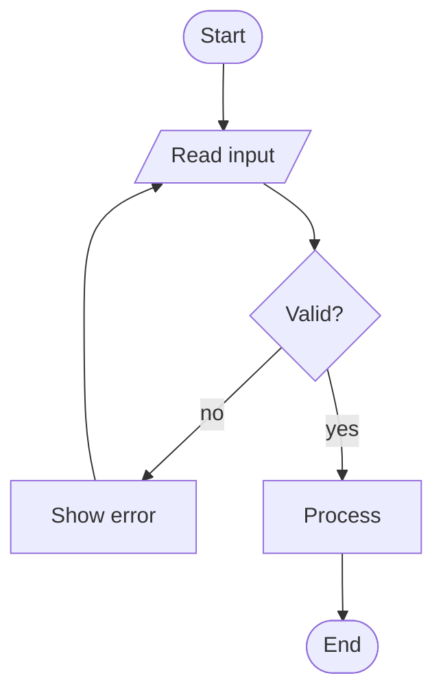
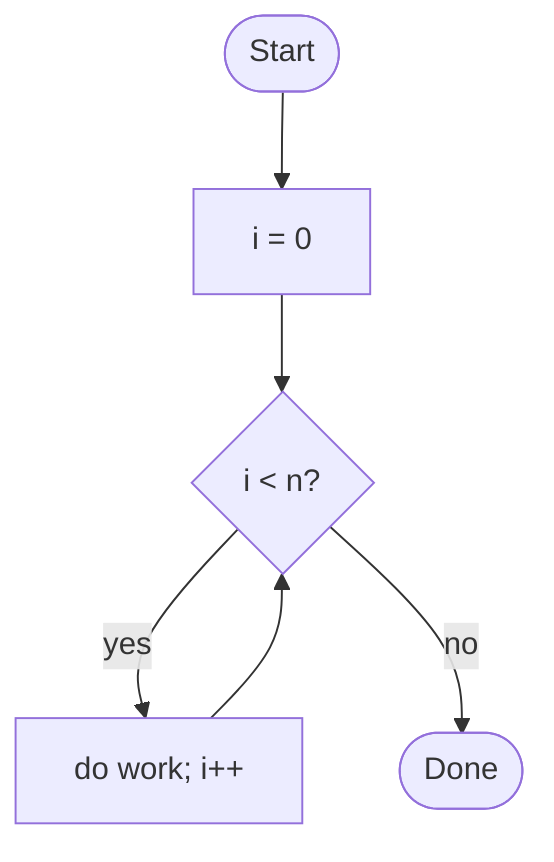
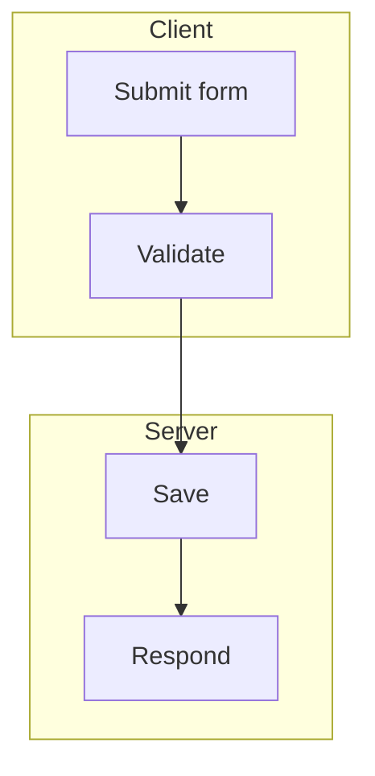
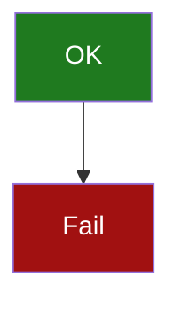
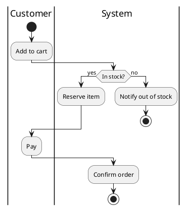

# Control flow / flowcharts (Mermaid)

Mermaid `flowchart` renders natively in GitHub, Claude artifacts, VS Code (with an
extension), Obsidian, and mermaid.live. Best default for control flow.

## Direction
`flowchart TD` (top-down), `LR` (left-right); also `TB`, `BT`, `RL`.

## Node shapes


## Edges
```mermaid
flowchart LR
  A --> B          %% arrow
  B --- C          %% open link
  C -->|label| D   %% labeled
  D -.-> E         %% dotted
  E ==> F          %% thick
```

## Decisions & branches — label every branch


## Loops


## Subgraphs (group / pseudo-swimlane)


## Styling


## When you need TRUE swimlanes -> PlantUML activity

PlantUML activity also supports `fork` / `fork again` / `end fork` for parallel flows and
`repeat` / `repeat while (cond)` for loops.

Render: `render.ps1 -File login.mmd -Format svg` (needs `mmdc`), or render the `.puml`
variant via PlantUML.
