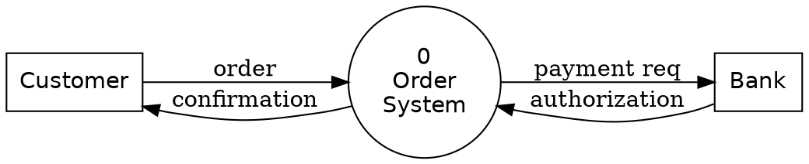
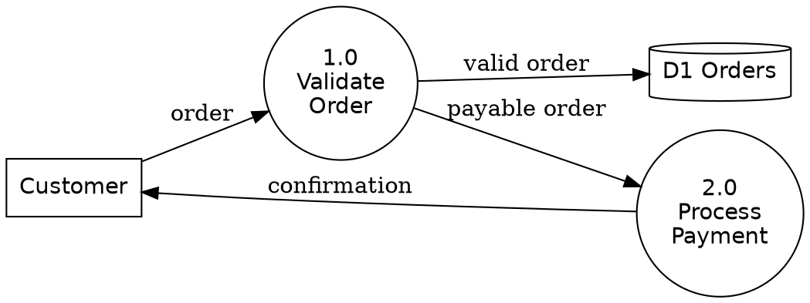
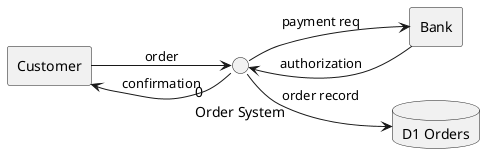

# Data Flow Diagrams (DFD)

A DFD shows how data **moves** through a system: who sends/receives it (external
entities), what transforms it (processes), and where it rests (data stores). It is **not**
a flowchart — no decisions or control flow, only data movement.

## Notation (4 elements)

| Element         | Meaning                          | Yourdon            | Gane–Sarson          |
|-----------------|----------------------------------|--------------------|----------------------|
| External entity | Source / sink outside the system | Rectangle          | Rectangle (shadowed) |
| Process         | Transforms data, **numbered**    | Circle             | Rounded rectangle    |
| Data store      | Where data is held               | Two parallel lines | Open-ended box       |
| Data flow       | Movement of data, **labeled**    | Labeled arrow      | Labeled arrow        |

Rules:
- Every process has at least one input AND one output (no "black holes" or "miracles").
- Data stores and external entities **never** connect directly — data must pass through a
  process.
- Flows are labeled with the **data** ("valid order"), not the action.

## Levels
- **Context (Level 0):** the whole system as **one** process (numbered 0), surrounded by
  external entities. No data stores shown.
- **Level 1:** decompose process 0 into processes 1.0, 2.0, … and reveal the data stores.
- **Balancing:** the inputs/outputs crossing the Level-1 boundary must match the Context
  diagram's flows exactly.

## Graphviz recipe (best layout control)

Context:

Level 1 (data store as cylinder; or `shape=record` styled open for strict Gane–Sarson):

## PlantUML recipe

## Picking the tool
- Multi-level, precise shapes, print quality -> **Graphviz** (`dot`).
- Quick, same toolchain as your use case diagrams -> **PlantUML**.

Render: `render.ps1 -File order-dfd.dot -Format svg` (needs `dot`), or the `.puml`
variant via PlantUML.
