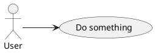
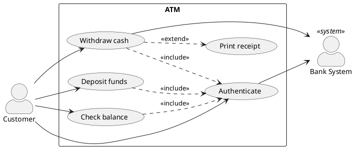

# Use Case diagrams (PlantUML)

Use case diagrams show **actors** (who/what uses the system), **use cases** (what the
system does for them), and a **system boundary**.

## Minimal



`left to right direction` reads better for use case diagrams than the default top-down.

## Actors

```plantuml
actor Customer
actor "Bank Clerk" as Clerk      ' quoted name + alias
actor Admin <<system>>           ' stereotype
:Power User: as PU               ' alternative syntax
```

Actors can be human OR external systems (payment gateway, mail server, scheduler).

## Use cases

```plantuml
(Browse catalog)                 ' parentheses = use case
usecase "Place order" as UC10    ' explicit with alias
usecase UC11 as "Cancel order"
```

## Associations & system boundary

```plantuml
@startuml
left to right direction
actor Customer
actor "Payment Gateway" as Pay <<system>>

rectangle "Online Shop" {        ' system boundary
  (Browse catalog) as Browse
  (Place order)    as Order
  (Make payment)   as MakePay
}

Customer --> Browse
Customer --> Order
Order ..> MakePay : <<include>>
MakePay --> Pay
@enduml
```

## include / extend / generalization

- `<<include>>` — base use case **always** runs the included one. Arrow `base ..> included`.
  `(Place order) ..> (Validate cart) : <<include>>`
- `<<extend>>` — extension runs **conditionally**. Arrow `extension ..> base`.
  `(Apply coupon) ..> (Place order) : <<extend>>`
- Generalization (inheritance) with `<|--`:
  - Actors: `Admin <|-- SuperAdmin` (SuperAdmin *is an* Admin)
  - Use cases: `(Pay) <|-- (Pay by card)`

## Notes & styling

```plantuml
note right of (Place order)
  Requires the customer to be logged in.
end note

skinparam actorStyle awesome      ' nicer stick-figure icon
skinparam packageStyle rectangle
```

## Worked example — ATM



Render: `render.ps1 -File atm.puml -Format svg` (needs the `plantuml` CLI or Java +
`plantuml.jar`; or pass `-AllowRemote` to use kroki.io).
